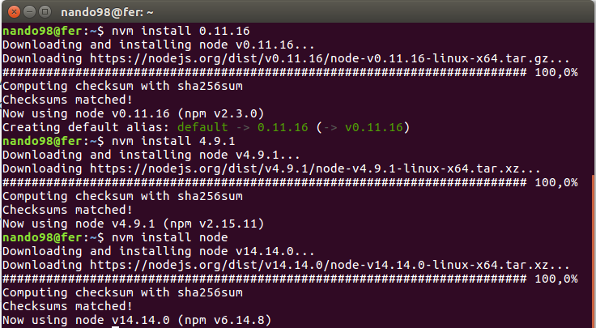
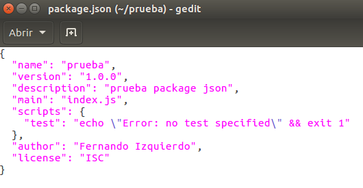
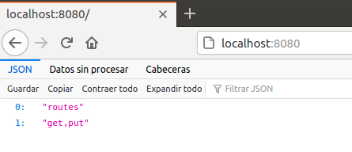
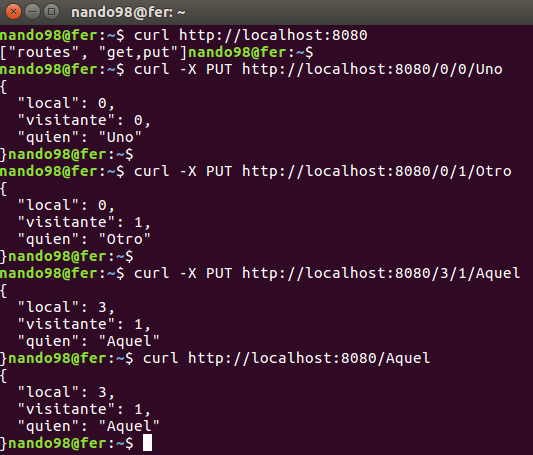

# Ejercicio 1. Instalar alguno de los entornos virtuales de node.js (o de cualquier otro lenguaje con el que se esté familiarizado) y, con ellos, instalar la última versión existente, la versión minor más actual de la 4.x y lo mismo para la 0.11 o alguna impar (de desarrollo).

Para gestionar los entornos virtuales de node.js utilizaremos *nvm*. Simplemente tenemos que utilizar el comando `nvm install` seguido de la versión que queremos instalar. En la imagen podemos ver que se han instalado tres versiones: 0.11.16, 4.9.1 y la más reciente (no tenemos que indicar ningún parámetro, es la opción por defecto).



Para cambiar entre las diferentes versiones de nodejs tenemos que usar el comando `nvm use version`, aunque existe la opción de crear un fichero .nvmrc con la versión que utilice ese proyecto de forma que cuando entremos en el proyecto solo tengamos que usar `nvm use` sin la versión y la coge del fichero automáticamente.

# Ejercicio 2. Crear una descripción del módulo usando package.json. En caso de que se trate de otro lenguaje, usar el método correspondiente.

Para crear el módulo package.json para nodejs utilizaremos `npm init`. A continuación comenzará a preguntarnos por los diferentes parámetros del package.json. A continuación muestro un ejemplo:



# Ejercicio 3. Descargar el repositorio de ejemplo anterior, instalar las herramientas necesarias (principalmente Scala y sbt) y ejecutar el ejemplo desde sbt. Alternativamente, buscar otros marcos para REST en Scala tales como Finatra o Scalatra y probar los ejemplos que se incluyan en el repositorio.

Para llevar a cabo este ejercicio necesitaremos Java 8 (jdk), que instalamos mediante el comando:

```
sudo apt install openjdk-8-jre
```

También necesitamos `sbt` para compilar el proyecto y el lenguaje `scala`. Para ello seguimos las intrucciones que vienen en este [tutorial](http://www.codebind.com/linux-tutorials/install-scala-sbt-java-ubuntu-18-04-lts-linux/).

Una vez tenemos instalado todo lo que necesitamos, clonamos el repositorio y seguimos las instrucciones que vienen en el mismo.





# Ejercicio 4. Para la aplicación que se está haciendo, escribir una serie de aserciones y probar que efectivamente no fallan. Añadir tests para una nueva funcionalidad, probar que falla y escribir el código para que no lo haga. A continuación, ejecutarlos desde mocha (u otro módulo de test de alto nivel), usando descripciones del test y del grupo de test de forma correcta. Si hasta ahora no has subido el código que has venido realizando a GitHub, es el momento de hacerlo, porque lo vamos a necesitar un poco más adelante.

Para este ejercicio vamos a utilizar un sencillo script de Python que tengo hecho de un pequeño ejercicio que realicé en otra asignatura. El script consiste en un programa que introducimos un precio de un producto, la cantidad de dinero que el cliente nos ha dado para pagarlo y el script lo que hace es imprimir por pantalla el número de monedas que tiene que devolver para el cambio (monedas de 2 y 1 euro o 50, 10 o 1 céntimos). Existen muchas máquinas que solo devuelven el cambio en monedas. A continuación mostramos el script inicial:

```
import decimal

precio = decimal.Decimal(input("Introduce el precio: "))
entrega = decimal.Decimal(input("Introduce la cantidad entregada: "))

vuelta = entrega-precio

euros = 0
euros_2 = 0
monedas_50 = 0
monedas_10 = 0
monedas_01 = 0

if vuelta == 0:
    print("Cantidad exacta, nada a devolver")
    
else:
    vuelta = vuelta * 100
    euros_2 = vuelta // 200
    assert euros_2 == 0
    resto = vuelta % 200

    if resto >= 100:
        euros = resto // 100
        resto = vuelta % 100
        assert euros == 1
    
    if resto >= 50:
        monedas_50 = resto // 50
        resto = resto % 50
        assert monedas_50 == 1
    
    if resto >= 10:
        monedas_10 = resto // 10
        resto = resto % 10
        assert monedas_10 == 0
        
    if resto >= 1:
        monedas_01 = resto //1
        assert monedas_01 == 0
                
print(" Monedas de 2EUR: {} \n Monedas de 1EUR: {} \n Monedas de 50cent: {} \n Monedas de 10cent: {} \n Monedas de 1cent: {}".format(euros_2, euros, monedas_50, monedas_10, monedas_01))
```

La prueba que se realiza para ver que funciona correctamente toma como parámetros un precio de 3.50 y el cliente paga con 5 euros, por lo tanto la vuelta serán 1.5 euros con una moneda de 5 y una moneda de 50 céntimos. Para comprobar que funciona, se han introducido una seríe de assert. El resultado es satisfactorio. En caso de modificar los parámetros, lógicamente falla.


Ahora vamos a intentar usar un módulo de test de alto nivel como es *pytest*. Para ello, vamos a modificar un poco el script y lo vamos a transformar en una función que devuelve una lista con el número de monedas a devolver de cada tipo:

```
import decimal

def vuelta(precio, entregado):
	precio = decimal.Decimal(precio)
	entregado = decimal.Decimal(entregado)

	vuelta = entregado-precio

	euros = 0
	euros_2 = 0
	monedas_50 = 0
	monedas_10 = 0
	monedas_01 = 0

	if vuelta == 0:
	    return 0
	    
	else:
	    vuelta = vuelta * 100
	    euros_2 = vuelta // 200
	    resto = vuelta % 200

	    if resto >= 100:
	        euros = resto // 100
	        resto = vuelta % 100
	    
	    if resto >= 50:
	        monedas_50 = resto // 50
	        resto = resto % 50
	    
	    if resto >= 10:
	        monedas_10 = resto // 10
	        resto = resto % 10
	        
	    if resto >= 1:
	        monedas_01 = resto //1

	lista = []
	lista.append(euros_2)
	lista.append(euros)
	lista.append(monedas_50)
	lista.append(monedas_10)
	lista.append(monedas_01)

	return lista
```

En un fichero aparte tenemos el test. La primera función *check_list* comprueba que dos listas son iguales. La segunda función *test_vuelta* es el test en cuestión que llama a la función anterior con un assert que llama a la función check_list comprobamos si la lista que nos devuelve la función y la lista del resultado que nos tiene que dar son iguales. El caso de uso es el mismo que el anterior (3.5 euros de precio y 5 euros lo que el cliente paga). A continuación mostramos el fichero test:

```
import pytest
from main import vuelta

def check_list(a, b):
	if len(a) != len(b):
		return False
	else:
		for i in range(0,len(a)):
			if a[i] != b[i]:
				return False
	return True

def test_vuelta():
	assert check_list(vuelta(3.5, 5), [0, 1, 1, 0, 0])
```

Lo ejecutamos poniendo simplemente `pytest` en la terminal (deben de estar los dos script en el mismo directorio). El resultado es satisfactorio.

# Ejercicio 5. Haced los dos primeros pasos antes de pasar al tercero.
