## Ejercicio 1.
**Buscar alguna demo interesante de Docker y ejecutarla localmente, o en su defecto, ejecutar la imagen anterior y ver cómo funciona y los procesos que se llevan a cabo la primera vez que se ejecuta y las siguientes ocasiones.**

Primero debemos de instalar docker y comprobar que funciona correctamente lanzando el Hello World.

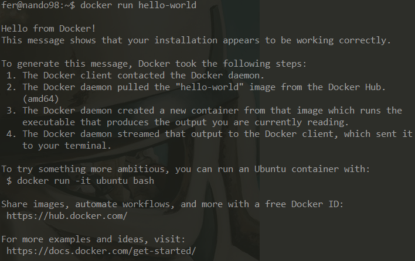

Con *docker ps -a* podemos ver los diferentes contenedores (al principio solo contamos con las de hello world).

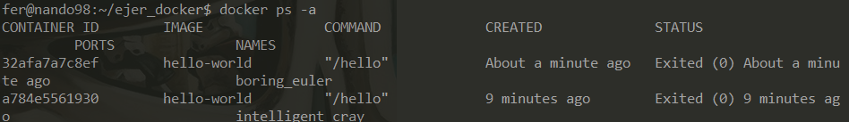

A continuación probamos una imagen de prueba.

```
docker run --rm jjmerelo/docker-daleksay -f smiling-octopus Hola, que tal
```

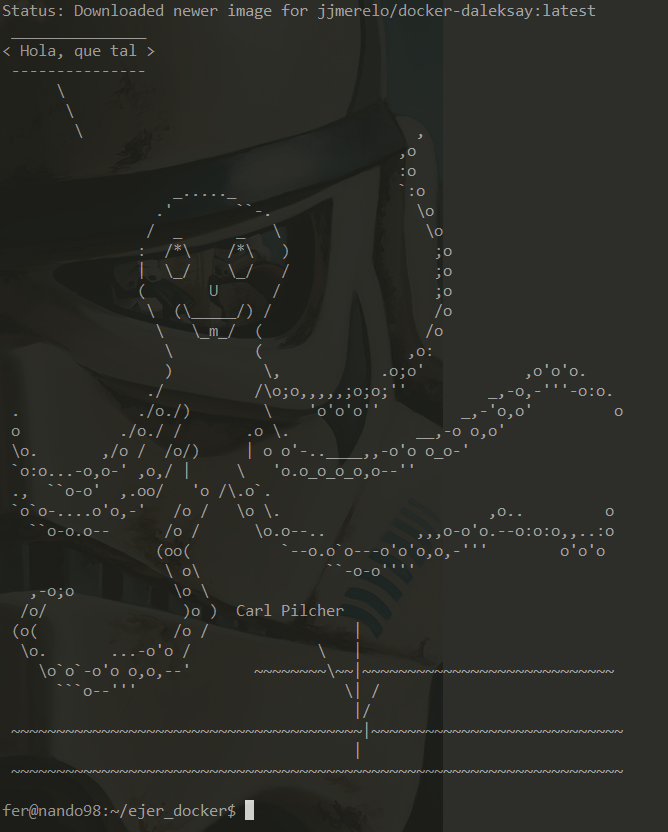

## Ejercicio 2.
**Tomar algún programa simple, “Hola mundo” impreso desde el intérprete de línea de órdenes, y comparar el tamaño de las imágenes de diferentes sistemas operativos base, Fedora, CentOS y Alpine, por ejemplo.**

El script a ejecutar es un simple *console.log("Hola mundo!")* en Javascript. Para practicar, intentaremos instalar Nodejs en los diferentes Dockerfiles.

Comenzamos con el Dockerfile de Fedora:

```
FROM fedora:latest

WORKDIR /home/cc_ejer

COPY ./helloworld.js .

RUN dnf install nodejs -y

CMD node helloworld.js

```

Construimos la imagen con: *docker build --no-cache -t fedora_hw .* y posteriormente lo ejecutamos, comprobando que funciona:

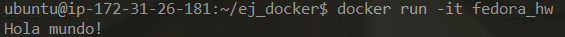

El Dockerfile para CentOS es bastante similar:

```
FROM centos:centos8

WORKDIR /home/cc_ejer

COPY ./helloworld.js .

RUN dnf install nodejs -y

CMD node helloworld.js

```

Construimos la imagen con: *docker build --no-cache -t centos_hw .* y comprobamos que funciona:

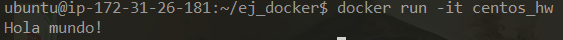

Finalmente el Dockerfile de Alpine:

```
FROM alpine:latest

WORKDIR /home/cc_ejer

COPY ./helloworld.js .

RUN apk add nodejs-current

CMD node helloworld.js

```

Construimos la imagen con: *docker build --no-cache -t alpine_hw .* y comprobamos que funciona:

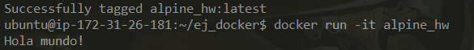

Seguidamente, comparamos el tamaño de las diferentes imágenes:

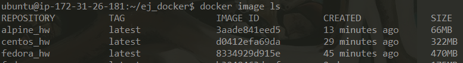

Como podemos observar, las imágenes de Fedora y CentOS son mucho más pesadas que las de Alpine a pesar de que hemos hecho acciones similares en los tres Dockerfiles. Esto se debe a que la instalación de cada sistema operativo trae diferentes configuraciones.

## Ejercicio 3.
**Crear a partir del contenedor anterior una imagen persistente con _commit_.**

Para crear una imagen persistenete con commit primero necesitamos conocer el identificador del contendero en cuestión. Lo vemos con *docker ps -a* y nos quedamos con el primero que nos aparece.

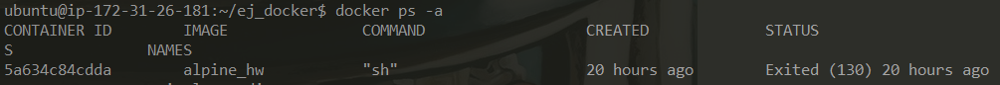

Ahora creamos una nueva imagen con commit. Indicamos el identificador y el nuevo nombre de la imagen. Posteriormente podemos ver con *docker images* que efectivamente se ha creado una nueva imagen y que tiene el mismo tamaño que la imagen original.

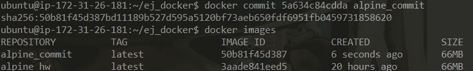

## Ejercicio 4.
**Examinar la estructura de capas que se forma al crear imágenes nuevas a partir de contenedores que se hayan estado ejecutando.**

En la imagen anterior podemos ver que como resultado nos ha devuelto un "sha". Es el que necesitamos para examinar la estructura de capas mediante la orden:

```
sudo jq '.' /var/lib/docker/image/overlay2/imagedb/content/sha256/50b81f45d387b d11189b527d595a5120bf73aeb650fdf6951fb0459731858620
```

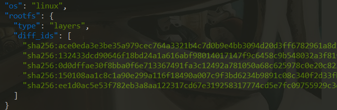

## Ejercicio 5.
**Crear un volumen y usarlo, por ejemplo, para escribir la salida de un programa determinado.**

Primero creamos el volumen "unVolumen" de la siguiente forma:

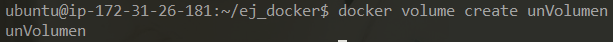

Vamos a utilizar la imagen de Alpine. Lo que pretendemos hacer es pasar la salida del script que tenemos que devuelve un "Hola Mundo" a un archivo (en el volumen en este caso).

Para ello, mientras que ejecutamos la imagen, montamos el volumen también con la opción *- v*. Comprobamos que estamos en el volumen con un sencillo *ls* y posteriormente ejecutamos el script y lo guardamos dentro del volumen.

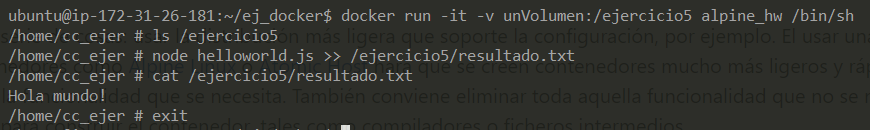

Para comprobar que lo hemos hecho correctamente, vamos a ver si realmente lo ha guardado en el volumen. Con la orden *inspect* a un volumen podemos ver la ruta de su *Mountpoint* que es donde se guardan los datos.

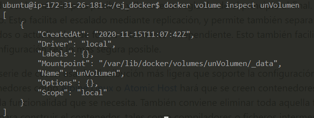

Nos dirigimos a esa ruta para comprobar que efectivamente existe y tiene el resultado correcto.

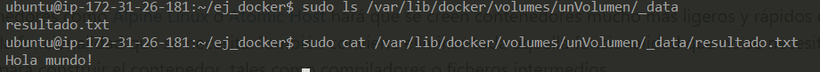