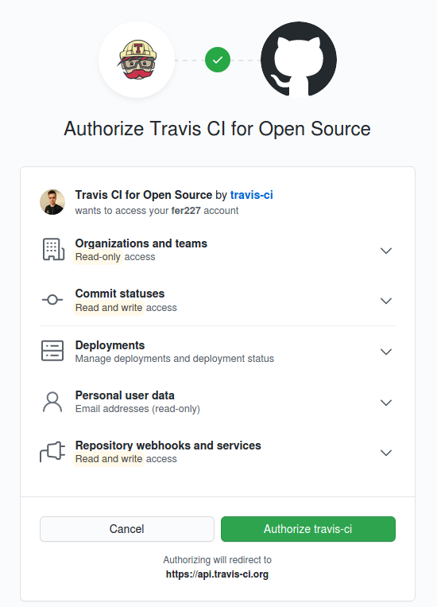
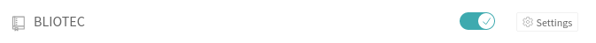

# Ejercicio 1. Haced los dos primeros pasos antes de pasar al tercero.

Primero iniciamos sesión con nuestra cuenta de Github.



Una vez dentro, nos dirigimos a *Settings* y activamos el repositorio en el que vamos a llevar a cabo la integración continua.



Finalmente creamos nuestro fichero [.travis.yml](https://github.com/fer227/BLIOTEC/blob/main/.travis.yml) con una pequeña configuración del lenguaje que vamos a utlizar (nodejs, la última versión de la 14). 

```
language: node_js
node_js:
  - 14
```

# Ejercicio 2. Configurar para nuestra aplicación.
El archivo de configuración de nuestro proyecto lo puedes encontrar [aquí](https://github.com/fer227/BLIOTEC/blob/main/.travis.yml).