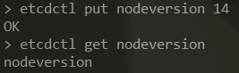
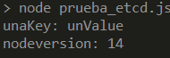
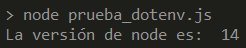
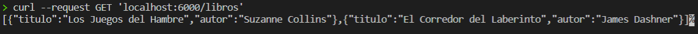
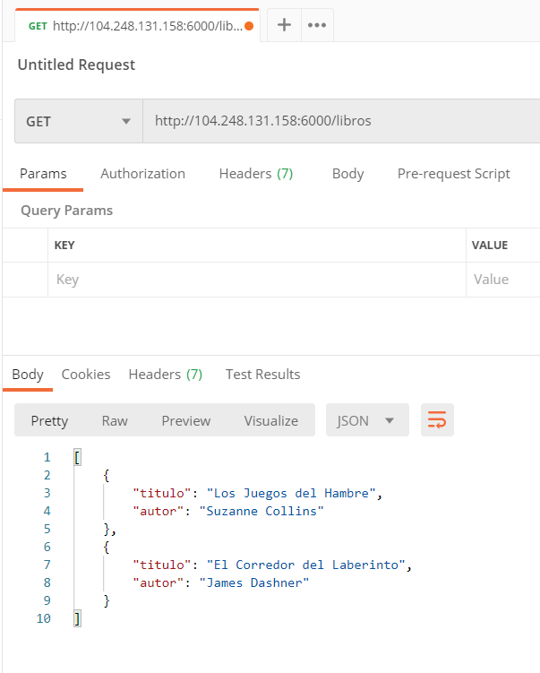
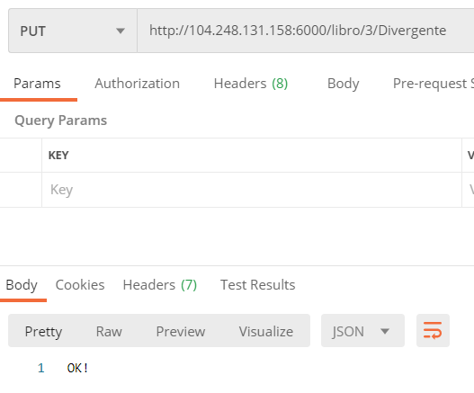
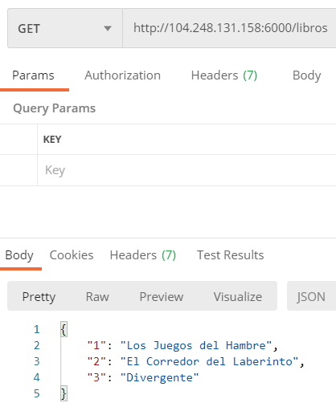
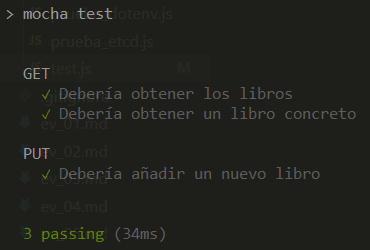

## Ejercicio 1
**Instalar etcd3, averiguar qué bibliotecas funcionan bien con el lenguaje que estemos escribiendo el proyecto (u otro lenguaje), y hacer un pequeño ejemplo de almacenamiento y recuperación de una clave; hacer el almacenamiento desde la línea de órdenes (con etcdctl) y la recuperación desde el mini-programa que hagáis.**

Para este ejercicio hemos probado las bibliotecas [etcd3](https://www.npmjs.com/package/etcd3) y [dotevn](https://www.npmjs.com/package/dotenv) de npm.

Previamente instalamos etcd3 en nuestra máquina y probamos a introducir una variable de entorno y a obtenerla:



Creamos el siguiente [script](./microservicios/prueba_etcd.js), donde introducimos una nueva variable de entorno junto a un valor y además obtenemos la variable que hemos introducido anteriormente por la terminal de comandos.
```
const { Etcd3 } = require('etcd3');
const etcd = new Etcd3();

(async () => {
    await etcd.put("unaKey").value("unValue");
    console.log('unaKey:', await etcd.get('unaKey').string());
    console.log('nodeversion:', await etcd.get('nodeversion').string());
})();
```

El resultado sería el siguiente:



A continuación probamos dotenv mediante este [script](./microservicios/prueba_dotenv.js), donde leemos la variable que definimos en el [.env](./microservicios/.env).
```
const dotenv = require('dotenv').config();
console.log("El puerto es: ", process.env.PORT);
```
Resultado:




### Ejercicio 2
**Realizar una aplicación básica que use algún microframework para devolver alguna estructura de datos del modelo que se viene usando en el curso u otra que se desee. La intención de este ejercicio es simplemente que se vea el funcionamiento básico de un microframework, especialmente si es alguno que, como express, tiene un generador de código. Se puede usar, por otro lado, el lenguaje y microframework que se desee.**

Lo llevamos a cabo mediante el siguiente [script](./microservicios/index.js):

```
const dotenv = require('dotenv').config();
const { response } = require('express');
var express = require('express');
var app = express();
var port = process.env.PORT || 6000;

app.get('/libros', (req, res) => {
    let libros = [
        {
            titulo: "Los Juegos del Hambre",
            autor: "Suzanne Collins"
        },
        {
            titulo: "El Corredor del Laberinto",
            autor: "James Dashner"
        }
    ];
    
    res.status(200);
    res.header("Content-Type",'application/json');
    res.send(
        JSON.stringify(libros)
    );
})

app.listen(port);
```

El resultado lo podemos comprobar realizando una petición en Postman o mediante Curl.





## Ejercicio 3
**Programar un microservicio en express (o el lenguaje y marco elegido) que incluya variables como en el caso anterior.**

Lo llevamos a cabo mediante el siguiente [script](./microservicios/index_variables.js) (cambia un poco la estructura de datos, pero para probar por primera vez nos vale). Declaramos una dos rutas *get* (una para obtener todos los libros y otra para obtener un libro concreto mediante identificador) y otra ruta *put* para introducir un nuevo libro.

```
const dotenv = require('dotenv').config();
const { response } = require('express');
var express = require('express');
var app = express();
var port = process.env.PORT || 6000;

var libros = {};
libros[1] = "Los Juegos del Hambre";
libros[2] = "El Corredor del Laberinto";

app.get('/libros', (req, res) => {
    res.status(200);
    res.header("Content-Type",'application/json');
    res.send(
        JSON.stringify(libros)
    );
})

app.get('/libro/:id', (req, res) => {
    res.status(200);
    res.header("Content-Type",'application/json');
    res.send(
        JSON.stringify(libros[req.params.id])
    );
})

app.put('/libro/:id/:titulo', (req, res) => {
    libros[req.params.id] = req.params.titulo; 
    res.status(200);
    res.header("Content-Type",'application/json');
    res.send(
        JSON.stringify(libros[req.params.id])
    );
})

app.listen(port);

module.exports = app;
```

Cabe destacar que es un script muy básico, también tendríamos que hacer comprobaciones de que existen los ID (por ejemplo). Hacemos peticiones mediante Postman para comprobar su correcto funcionamiento (primero introducimos un nuevo elemento y luego los obtenemos todos).






## Ejercicio 4
**Crear pruebas para las diferentes rutas de la aplicación.**

Hacemos las pruebas mediante Mocha y la biblioteca Supertest. Este sería el [script](./microservicios/test.js) donde se encuentran los test del script mostrado anteriormente.

```
var request = require('supertest');
app = require('./index_variables.js');

describe("GET", function(){
    it("Debería obtener los libros", function(done){
        request(app)
            .get("/libros")
            .expect('Content-Type', /json/)
            .expect(200, done);
    });

    it("Debería obtener un libro concreto", function(done){
        request(app)
            .get("/libro/1")
            .expect('Content-Type', /json/)
            .expect(200, done);
    });
});

describe("PUT", function(){
    it("Debería añadir un nuevo libro", function(done){
        request(app)
            .put("/libro/3/Divergente")
            .expect('Content-Type', /json/)
            .expect(200, done);
    });
});
```

Resultados:



## Ejercicio 6
**Usar rake, invoke o la herramienta equivalente en tu lenguaje de programación para programar diferentes tareas que se puedan lanzar fácilmente desde la línea de órdenes un microservicio.**

En el proyecto que estamos desarrollando contamos con gulp como gestor de tareas. Próximamente incluiremos tareas para lanzar microservicios. 

- [gulpfile de nuestro proyecto](https://github.com/fer227/BLIOTEC/blob/main/gulpfile.js)