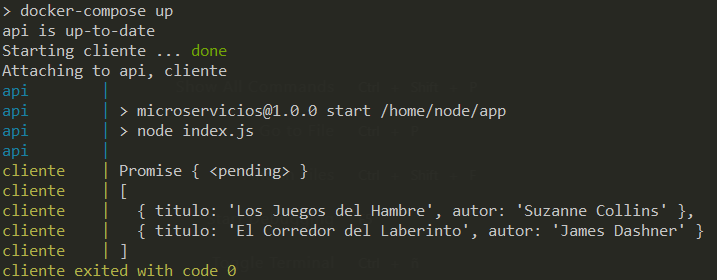

## Ejercicio 2
**Usar un miniframework REST para crear un servicio web y introducirlo en un contenedor, y componerlo con un cliente REST que sea el que finalmente se ejecuta y sirve como “frontend”.**

Vamos a utilizar la pequeña prueba en *Express* que utilizamos en los ejercicios del tema anterior. Se puede consultar en este [archivo](./microservicios/index.js). Este será el que haga de servidor o backend. Podemos hacer la prueba a la ruta GET establecida.

Para poder componer el servicio, primero tenemos que contenerizar la aplicación. El *Dockerfile* es el [siguiente](./microservicios/Dockerfile):

```
FROM node:14-alpine3.10

RUN mkdir -p /home/node/app/node_modules && chown -R node:node /home/node/app

WORKDIR /home/node/app

COPY package*.json ./

USER node

RUN npm install

COPY --chown=node:node . .

EXPOSE 6000

CMD [ "npm", "start" ]
```

Es importante *exposear* el puerto en el que se escucha. Por comodidad, usammos la imagen de Node. Primero instalamos las dependencias y posteriormente copiamos el resto del proyecto. Lo que no se necesite, se ha ignorado mediante un *.dockerignore*:

```
node_modules
.env
Dockerfile
index_variables.js
prueba-dotenv.js
prueba_etcd.js
test.js
```

Vamos a crear un pequeño cliente que haga una petición GET al servidor y nos muestre el resultado por consola. El fichero que actúa como [cliente](./cliente/cliente.js) se muestra a continuación (aunque también es un proyecto, pues tiene su *package.json* ya que utilizamos la librería **node-fetch**):

```
const fetch = require("node-fetch");

async function getData(){

    // await new Promise(resolve => setTimeout(resolve, 1200));

    return await fetch('http://localhost:6000/libros', {
        method: 'GET'    
    });
}

function handlerRequest(){
    getData().then((response) => {
        console.log(response.json().then((res) => {console.log(res)}));
    }).catch((error) => {
        console.log(error);
    }) 
}

setTimeout(handlerRequest, 500);
```

Vamos a explicar un poco este cliente:
1. Definimos la función **getData** donde se realiza la petición mediante *fetch*. Para ello simplemente indicamos la dirección y el método. Como es una operación asíncrona, necesitamos que la función sea *async* y la línea en cuestión tiene que estar precedida de un *await*.
2. Declaramos una segunda función para manipular la respuesta de ese *fetch*. Resulta que el método *json()* de la respuesta de fetch también tenemos que tratarla mediante un call-back (*then*).
3. Llamamos a la función mediante un **setTimeout()** a los 500 milisegundos. Más adelante explicaremos el porqué de esto.

Finalmente tenemos que implementar nuestro [docker-compose.yml](./docker-compose.yml).

```
version: '3'
services:
   api:
      container_name: api
      build: microservicios/.
      ports:
         - "6000:6000"
      network_mode: host   

   cliente:
      container_name: cliente
      build: cliente/.
      network_mode: host
      depends_on:
         - api
```

1. Declaramos dos servicios: **api** para el *backend* y **cliente** para el "*frontend*."
2. En la etiqueta *build* indicamos dónde puede encontrar el Dockerfile.
3. En el servidor también tenemos que indicar el puerto.
4. Gracias a la sentencia **network_mode: host** podemos utilizar el *localhost*. En caso de no utilizar esto (no es muy buena práctica), podríamos crear una red mediante la etiqueta network y utilizar la dirección *0.0.0.0*.
5. Finalmente indicamos que el cliente depende de la api. Pero esto solo lo tiene en cuenta para la construcción de los servicios, no para el lanzamiento de los mismos. Por eso he llamado en el cliente a la función que obtiene los datos mediante **setTimeout**, ya que (en mi caso) lanzaba antes al cliente y lógicamente no encontraba la dirección. De esta forma, espera medio segundo y ya tiene el servicio disponible.

Lanzamos los servicios con la orden **docker-compose up** (crea las imágenes de Docker si no lo estaban ya y si queremos volver a construirlas, podemos hacer **docker-compose build**). El resultado es satisfactorio:

